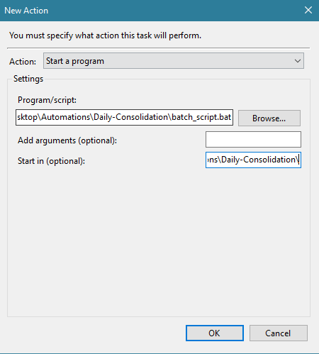

# Daily Consolidation

This script is utilized to combine the daily pre-registration outputs. It utilizes TKinter to request input from the user on the month and year of the files they want to combine. It will only combine the files for that month and will generate a monthly file that contains all the daily files into a monthly.

## First Time Setup:

1. Save this project folder in your desired location.
2. Disconnect from the VPN.
3. Open the command line window and ensure the current directory is

```
C:\Users\%Your_Universal_ID%
```

3. Run the following command to install dependencies

```
npm install -r requirements.txt
```

4. Reconnect to the VPN
5. In Sharepoint, navigate to the folder where the where the daily reports are saved and press "Sync". This will link the Sharepoint directory to your OneDrive, which allows you to access files from the Windows Explorer.

   
   

6. In main.py, change the following two variables. "source_dir" should be the folder location where the daily files are saved. "dest_dir" should be the folder where you want the consolidated files saved. If that directory does not exist, one will be created.
   

## Running:

There are 2 different ways to run this automation: on request and scheduled.

### Request

1. Open main.py in your preferred IDE and run the script.
2. A popup window will appear, prompting for a month and year in MM and YYYY respectively.
   

### Scheduled

1. Open Windows Task Scheduler
2. On the right sidebar, click "Create Task"
   
3. Under the "General" tab, select a name for the automation
4. Under the "Triggers" tab, click "New" and select the frequency in which you want this to run.
5. Under the "Actions" tab, click "New"
6. In the "Program/script" field, browse for the file in this directory called "batch_script.bat"
7. In the "Start in (optional) field, enter the directory location for the "batch_script.bat" file, but do not enter the file name.
   
8. Under the "Conditions" tab, uncheck the box for "Start the task only if the computer is on AC power", which will allow the script to run if you are disconnected from your dock/power supply.
9. Press "OK" to save the chages.
10. When your designated scheduled time occurs, a command line window will automatically open and prompt for your inputs.
    

12. A loading bar will show you the progress of the action.

